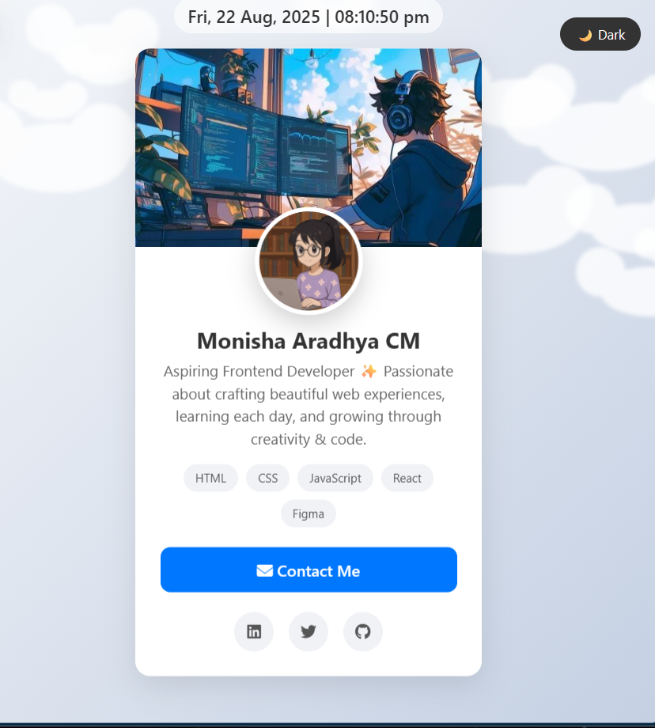

# My Profile Card 🌸

This is an elegant and dynamic profile card built with HTML, CSS, and JavaScript. It's a personal portfolio project designed to showcase my skills in frontend development and my attention to detail.

---

## 🚀 Live Demo

Experience the live project here: [https://your-username.github.io/your-repo-name/](https://moni-tech.github.io/My-Profile-Card/)

---

## ✨ Features

- **Dynamic Theme Toggle**: Switch between Light (with clouds) and Dark (with stars) themes.
- **Real-time Clock**: Displays the current date and time.
- **Smooth Animations**: Hover effects and transitions for a modern UI.
- **Responsive Design**: Looks great on both desktop and mobile devices.
- **Social Links**: Easy access to my professional profiles.

---

## 📸 Sneak Peek

**Light Theme:**

 

**Dark Theme:**

---

## 🛠️ Built With

- **HTML5**: For the semantic structure of the page.
- **CSS3**: For styling, animations, and transitions.
- **JavaScript**: For theme toggling and dynamic background generation.

---

## 🔗 Connect With Me

- [LinkedIn](https://www.linkedin.com/in/monisha-aradhya-cm-7069b8259)
- [GitHub](https://github.com/Moni-tech)
- [Email](mailto:monitech.projects@gmail.com)

---

## 💡 Next Steps

- Deploy this portfolio on **GitHub Pages / Netlify** to make it publicly accessible.
- Add more sections (Projects, Experience, Blogs) in the future to expand it into a full portfolio site.
- Integrate the live demo link into this README.

---

_“Learning, creating, and growing — one step at a time.”_ ✨